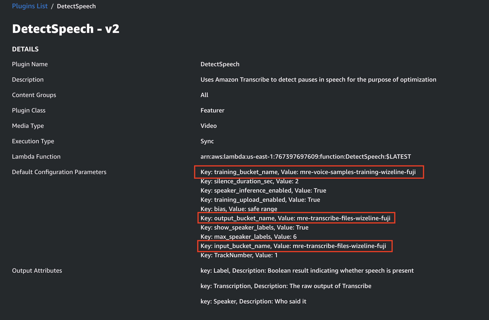

# MRE - WizeLine instruction

## Prerequisites

* python == 3.11
* aws-cli
* aws-cdk >= 2.24.1
* docker
* node >= 20.10.0
* npm >= 10.2.3
* git

## How to install MRE

## Step 1: Install MRE Core

```bash
REGION=[specify the AWS region. For example, us-east-1]
VERSION=2.9.0
git clone https://git-codecommit.us-east-1.amazonaws.com/v1/repos/aws-media-replay-engine-gen-ai
git checkout feat/wl-main
cd aws-media-replay-engine-gen-ai
cd deployment
./build-and-deploy.sh --enable-ssm-high-throughput --enable-generative-ai --version $VERSION --region $REGION [--profile <aws-profile>]
```

## Step 2: Install MRE's plugins

1. Install necessasry lambda layers at `labmda-layers`:
   
```bash
cd lambda-layers
./deploy.sh [aws-profile] [aws-region]
```

1. Replace plugin list in `aws-media-replay-engine-gen-ai/samples/source/mre-plugin-samples/Plugins` with the plugins in `sample-plugins` folder.
2. Replace the following data into `aws-media-replay-engine-gen-ai/samples/source/mre-plugin-samples/cdk/cdk.context.json`

```json
{
    "Plugins": [
        "DetectActivePresenter",
        "DetectAudioPeaks",
        "DetectCameraScene",
        "DetectCelebrities",
        "DetectPassThrough100",
        "DetectSceneLabels",
        "DetectSentiment",
        "DetectSpeech",
        "DetectTennisScoreBoxData",
        "LabelBasic",
        "LabelNews",
        "LabelPassThrough",
        "LabelTennisScore",
        "OptimizePassThrough",
        "SegmentByKeyMoment",
        "SegmentBySceneChange",
        "SegmentNews",
        "SegmentPassThrough100",
        "DetectKeyContent",
        "SegmentNewsNotification"
    ]
}
```

3. Run command:

```bash
cd aws-media-replay-engine-gen-ai/samples/deployment
./build-and-deploy.sh --app plugin-samples --region $REGION [--profile <aws-profile>]
```

## Step 3: Plugin configuration: (WIP)

**Many (or all) steps in this section can be automated in script file, but at the point when this document is written, we don't have time and resource to update the script**

1. [Add plugin roles](Plugin-Roles.md)
2. Create the following S3 buckets:
  
  - `mre-transcribe-files-wizeline-[poc name]`
  - `mre-voice-samples-training-wizeline-[poc name]`
  - `mre-wizeline-video-samples-[poc name]`: Enable Bucket Versioning

3. Add `DetectSpeech` new version with bucket name `mre-transcribe-files-wizeline-[poc name]` and `mre-voice-samples-training-wizeline-[poc name]`:

    

4. Create `temp-chunk-vars` table in dynamodb
5. Request model access in Bedrock:
   - Titan Embeddings G1 - Text
   - Titan Text G1 - Express
   - Titan Text Embeddings V2
   - Claude 3 Sonnet
   - Claude 3 Haiku
   - Claude
   - Claude Instant
   - Embed English

## Step 4: Install `live-news-segmenter` app

```bash
cd aws-media-replay-engine-gen-ai/samples/deployment
./build-and-deploy.sh --app [live-news-segmenter || live-news-segmenter-ui || live-news-segmenter-api] --region $REGION [--profile <aws-profile>]
```