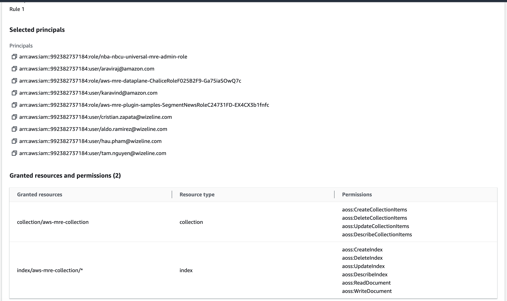
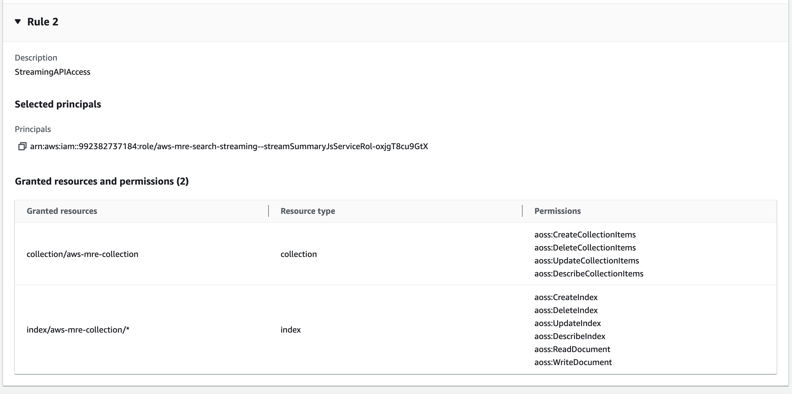

# MRE - WizeLine instruction

## Prerequisites

* python == 3.11
* aws-cli
* aws-cdk >= 2.24.1
* docker
* node >= 20.10.0
* npm >= 10.2.3
* git

## How to install MRE

## Step 1: Install MRE Core

```bash
REGION=[specify the AWS region. For example, us-east-1]
VERSION=2.9.0
git clone https://git-codecommit.us-east-1.amazonaws.com/v1/repos/aws-media-replay-engine-gen-ai
git checkout feat/wl-main
cd aws-media-replay-engine-gen-ai
cd deployment
./build-and-deploy.sh --enable-ssm-high-throughput --enable-generative-ai --version $VERSION --region $REGION [--profile <aws-profile>]
```

## Step 2: Install MRE's plugins

1. Install necessasry lambda layers at `labmda-layers`:
   
```bash
cd lambda-layers
./deploy.sh [aws-profile] [aws-region]
```

2. Replace plugin list in `aws-media-replay-engine-gen-ai/samples/source/mre-plugin-samples/Plugins` with the plugins in `sample-plugins` folder.
3. Replace the following data into `aws-media-replay-engine-gen-ai/samples/source/mre-plugin-samples/cdk/cdk.context.json`

```json
{
    "Plugins": [
        "DetectActivePresenter",
        "DetectAudioPeaks",
        "DetectCameraScene",
        "DetectCelebrities",
        "DetectPassThrough100",
        "DetectSceneLabels",
        "DetectSentiment",
        "DetectSpeech",
        "DetectTennisScoreBoxData",
        "LabelBasic",
        "LabelNews",
        "LabelPassThrough",
        "LabelTennisScore",
        "OptimizePassThrough",
        "SegmentByKeyMoment",
        "SegmentBySceneChange",
        "SegmentNews",
        "SegmentPassThrough100",
        "DetectKeyContent",
        "SegmentNewsNotification"
    ]
}
```

4. Run command:

```bash
cd aws-media-replay-engine-gen-ai/samples/deployment
./build-and-deploy.sh --app plugin-samples --region $REGION [--profile <aws-profile>]
```

## Step 3: Plugin configuration: (WIP)

**Many (or all) steps in this section can be automated in script file, but at the point when this document is written, we don't have time and resource to update the script**

1. [Add plugin roles](Plugin-Roles.md)
2. Create the following S3 buckets:
  
  - `mre-transcribe-files-wizeline-[poc name]`
  - `mre-voice-samples-training-wizeline-[poc name]`
  - `mre-wizeline-video-samples-[poc name]`: Enable Bucket Versioning

3. Add `DetectSpeech` new version with bucket name `mre-transcribe-files-wizeline-[poc name]` and `mre-voice-samples-training-wizeline-[poc name]`:

    

4. Create `temp-chunk-vars` table in dynamodb
5. Request model access in Bedrock:
  - Titan Embeddings G1 - Text
  - Titan Text G1 - Express
  - Titan Text Embeddings V2
  - Claude 3 Sonnet
  - Claude 3 Haiku
  - Claude
  - Claude Instant
  - Embed English
6. Create OpenSearch Serverless cluster aws-mre-collection
  - Collection name: aws-mre-collection
  - Collection type: Vector search
  - Deployment type: Enable redundancy (active replicas)
  - Security: Standard create
  - Encryption: Use AWS owned key
  - Network access settings:
    + Access Type: Public
    + Enable access to OpenSearch endpoint
    + Enable access to OpenSearch Dashboards
  - Configure data access:
    + Rule 1: Add all needed principals and permissions

    + Rule 2: Add all needed principals and permissions
    

7. Update some lambda functions below for missing some configurations
  - DetectSceneLabels:
   + Add Layers: MediaReplayEnginePluginHelper, Pillow, boto3, pyAV
   + Find dynamoDB table which the prefix `wl-mre-custom-api-GenAiTemplates` and update lambda parameter with corespoding value  `genai_templates_table = dynamodb.Table('wl-mre-custom-api-GenAiTemplates...')`
  - DetectCelebrities:
   + Add Layers: MediaReplayEnginePluginHelper, Pillow, pyAV, json-repair
   + Find dynamoDB table which the prefix `wl-mre-custom-api-GenAiTemplates` and update lambda parameter with corespoding value `genai_templates_table = dynamodb.Table('wl-mre-custom-api-GenAiTemplate...')`
  - DetectSpeech
   + Add Layers: MediaReplayEnginePluginHelper, ffmpeg
  - SegmentNews: Also change Dynamo table names
   + Add Layers: MediaReplayEnginePluginHelper, opensearch-py, boto3, json-repair
   + Find dynamoDB table which the prefix `wl-mre-custom-api-GenAiTemplates` and update lambda parameter with corespoding value `genai_templates_table = dynamodb.Table('wl-mre-custom-api-GenAiTemplate...')`
8. Add SegmentNews environment variables
  ```
  OPEN_SEARCH_SERVERLESS_CLUSTER_EP: {{Open search endpoint of aws-mre-collection}} (e.g., el38g1x1i9agzdwkws10.us-east-1.aoss.amazonaws.com)
  OPEN_SEARCH_SERVERLESS_CLUSTER_REGION: us-east-1
  ```
9. Add Data access policies for AOSS's mre-vectorsearch-collection

## Step 4: Install `live-news-segmenter` app

```bash
cd aws-media-replay-engine-gen-ai/samples/deployment
./build-and-deploy.sh --app [live-news-segmenter || live-news-segmenter-ui || live-news-segmenter-api] --region $REGION [--profile <aws-profile>]
```